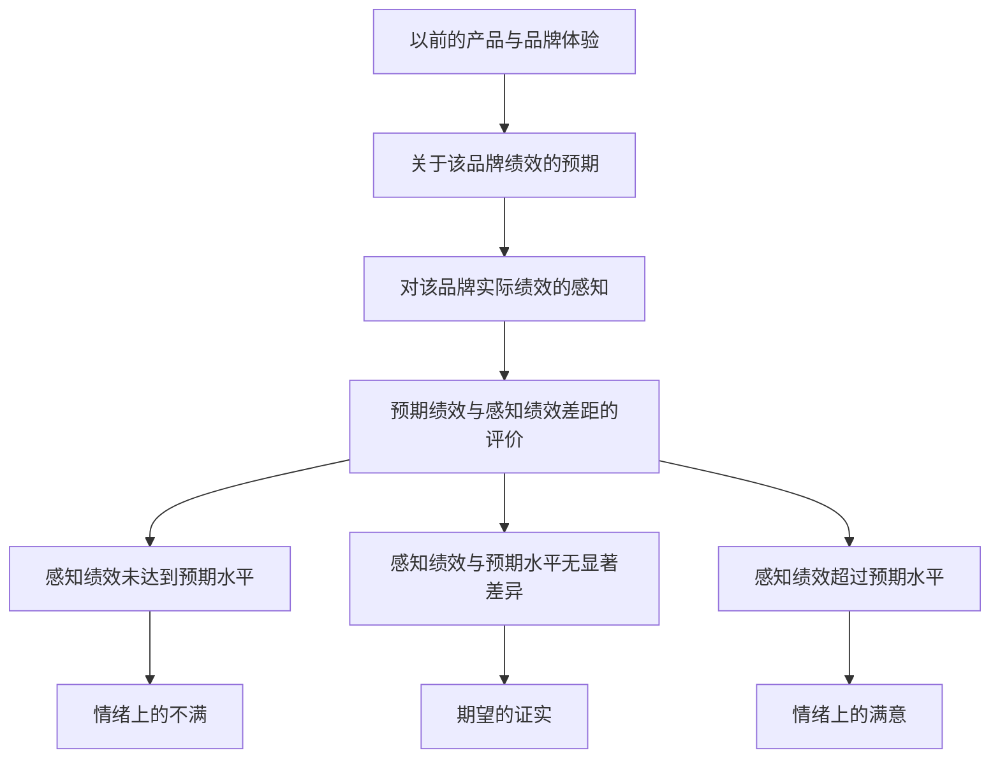

# 第四章 消费者决策过程：购后行为

## 第一节 购后冲突

### 一、购后冲突的概念与心理学基础
**购后冲突**是指因为某个购买而引起消费者的心理焦虑、怀疑和不安。从心理学角度看，购后冲突是由于**认知失调**所引起的。
**认知失调**就是两个认知之间出现逻辑上的不一致。例如：明知沉溺于网络游戏会影响学业，但仍然痴迷不能自拔。

### 二、购后冲突的示例分析
**课堂讨论**：在这次手机购买之后，为何会产生心理冲突？

**示例**：如果选择了三星手机，放弃了苹果iPhone，你可能会感到：
1. 三星真的很不错
2. 三星速度似乎没有iPhone快
3. 安卓系统还是没有苹果好
→ **产生冲突！（认知失调）**

### 三、影响购后认知冲突强度的因素
1. **偏爱程度相当**：既想要三星手机，又想要iPhone
2. **属性各有高低**：三星兼容性强，但是iPhone速度快
3. **选择自由**：既可以买得起三星，又能买得起iPhone
4. **介入程度高**：手机对于自己来说很重要
5. **决定不易改变**：买了之后要用很长时间，而且不能退货
6. **个人焦虑程度**：我总是会担心自己买的不合适

### 四、如何降低购后冲突？
在上述手机购买情境中，如何降低购后冲突呢？

**降低购后冲突的方法**：
1. **增加对三星的欲求感**
2. **减少对iPhone的欲求感**
3. **降低购买决策的重要性**
4. **通过退货改变购买决定**
5. **搜索更多外部信息来证明购买三星是明智的选择**

**随堂测试**：如果选择了"三星"手机，放弃了iPhone，你可能会感到怎样的冲突？如何降低？

## 第二节 产品的使用与闲置

### 一、消费者如何安装产品？
1. **开箱体验（拆包裹）**
2. **提供上门安装服务**
3. **按照安装与使用说明来做**
4. **安装本身也是一种体验**

### 二、消费者如何使用产品？
1. **这对企业非常重要**
2. **可能采用创新式方法**
3. **存在地区差异**
4. **使用频率/使用量或消费量/使用间隔相关**
5. **与配套产品的购买相关**

### 三、产品闲置
产品闲置是指消费者购买产品后，由于各种原因未能充分使用或完全未使用的情况。

## 第三节 消费者的满意与不满

### 一、消费者满意与不满的形成过程
消费者满意与不满的形成基于以下过程：

### 二、影响消费者满意的因素
#### 1. 影响预期的因素
- **产品因素**
- **促销因素**
- **竞争品牌的影响**
- **消费者特征**

#### 2. 影响实际认知的因素
- **产品的品质与功效**
- **消费者对产品的态度和情感**
- **消费者对产品的期望**
- **对交易是否公平的感知**
- **消费者归因（复盘）**
### 三、网上购物的满意或不满意因素
- **网站设计和互动**
- **隐私和安全**
- **订单执行与可靠性**
- **顾客服务**

## 第四节 消费者不满及其行为反应

### 一、消费者不满的行为反应类型
消费者在不满时可能采取以下行为：

#### 1. 自认倒霉，不采取外显的抱怨行为
- 认为抱怨行为会花费时间、精力
- 认为抱怨也无济于事
#### 2. 采取私下行动
- 转换品牌
- 将不好的体验传播给身边的人
#### 3. 直接对零售商或制造商提出抱怨
- 要求补偿或补救（作为企业，这种行为应该是常态）
#### 4. 要求第三方予以谴责或干预
- 媒体
- 政府或消费者组织
- 法律诉讼

### 二、影响消费者抱怨行为的因素
- **消费者不满的程度或水平**
- **消费者对抱怨本身的态度**
- **从抱怨行动中获得的利益大小**
- **消费者的个性**
- **对问题的归因**
- **产品对消费者的重要性**
- **消费者用于抱怨的资源**

### 三、企业对于消费者不满的应对措施
1. **为产品或服务提供强有力的担保**
2. **畅通渠道，认真听取顾客抱怨**
3. **迅速采取行动，公平对待顾客**
### 四、处理愤怒客户的技巧
**愤怒客户六要**：
1. 坐下来说话
2. 竟有这种事
3. 首先要道歉
4. 然后要感谢
5. 请您帮个忙
6. 我有个建议

**六不要**：
1. 不要还击客户
2. 不要解释开脱
3. 不要假装幽默
4. 不要滔滔不绝
5. 不要戳穿客户
6. 不要目标不清

**案例分析**：美国万豪饭店重视顾客投诉
- 董事长兼总裁比尔·马里奥特每年要亲自阅读大约8000封顾客来信中的10%
- 75万份顾客意见卡中的2%

## 第五节 重复购买与品牌忠诚

### 一、重复购买与品牌忠诚的概念
**重复购买**是指在相当长的时间内选择一个品牌或极少的几个品牌。
**品牌忠诚**：消费者对某一品牌形成偏好，试图重复选择该品牌的倾向。

### 二、习惯型购买者 vs. 忠诚型购买者
| 类型     | 特征               | 购买动机    |
| ------ | ---------------- | ------- |
| 习惯型购买者 | 习惯、没有更好的备选品、最便宜的 | 基于便利和价格 |
| 忠诚型购买者 | 品牌偏好、情感依赖        | 基于情感和认同 |
### 三、品牌忠诚的特征
1. **非随意性**：不是随意选择的结果
2. **非口头偏好**：不仅仅是口头上的偏好
3. **家庭或个人行为**：可能涉及家庭决策
4. **一个或少数品牌**：集中在少数几个品牌
5. **是决策、评价等心理活动的结果**：经过心理过程的选择

### 四、品牌忠诚度的测定方法

#### 1. 比较法
- 根据消费者对某类产品购买的品牌选择历史资料
- 通过品牌选择图来进行判断
#### 2. 频率测定法
- 根据消费者对某类产品购买的品牌选择历史资料
- 忠诚度 = 选择特定品牌的频率 / 购买这类商品的总数
#### 3. 货币测定法
- 通过销售试验，观察消费者对某特定品牌愿意支付的额外费用
- 既包括多余现金支出，也包括更多的时间和搜寻费用
### 五、品牌忠诚的成因
1. **减少"知觉风险"**：时间损失、危害性、自我损失、经济风险
2. **应对风险**：搜寻信息、从中购买、形成对品牌的忠诚
3. **品牌形象与自我形象保持一致**
4. **通过广告宣传改正和引导顾客对品牌形象的认知**
5. **保持产品品质一致性**
6. **节省搜索时间、心力**
### 六、影响品牌忠诚的因素
1. **产品吸引**
2. **时间压力**
3. **风险因素**
4. **自我形象**
5. **家庭收入提高，时间机会成本加大**
6. **家庭规模增加，倾向于多花时间搜寻信息，忠诚度下降**
7. **购买间隔越长，越有时间搜寻信息**
## 第六节 产品与包装的处置

### 一、企业为什么要关注产品、包装的处置？
1. **现有产品处理不好，消费者可能会推迟甚至放弃新产品的购买**
2. **转手或赠送二手产品的决定可能导致形成巨大的二手市场**
3. **人们关注产品、包装如何处理，甚至将其视为产品的一个属性**
4. **能够提供比消费者自我报告更为准确和丰富的信息**

### 二、消费者处置产品时的主要方式
根据Jacoby, Berning和Dietvorst的研究，消费者处置产品的主要方式包括：

#### 1. 产品保存
- **用于初始用途**
- **用于新的用途**
- **存储**

#### 2. 暂时性处置
- **出租**
- **出借**
- **换取其他物品**

#### 3. 永久性处置
- **出售**
- **赠送**
- **扔掉**

### 三、产品处置的营销启示
企业需要关注产品生命周期的全过程，包括产品的最终处置阶段。这不仅涉及环境保护和社会责任，也影响消费者的购买决策和品牌形象。

---

**总结要点**：
1. 购后冲突源于认知失调，影响消费者购买后的心理状态
2. 产品使用与闲置反映了消费者对产品的实际利用情况
3. 消费者满意基于预期与实际感知的对比
4. 消费者不满可能引发多种行为反应，企业需要有效应对
5. 品牌忠诚是消费者重复购买的心理基础，受多种因素影响
6. 产品与包装的处置是消费者决策过程的重要环节，企业需要关注

**核心问题**：
- 如何应对消费者购买后的认知失调/不满？
- 如何推动消费者形成品牌忠诚？
