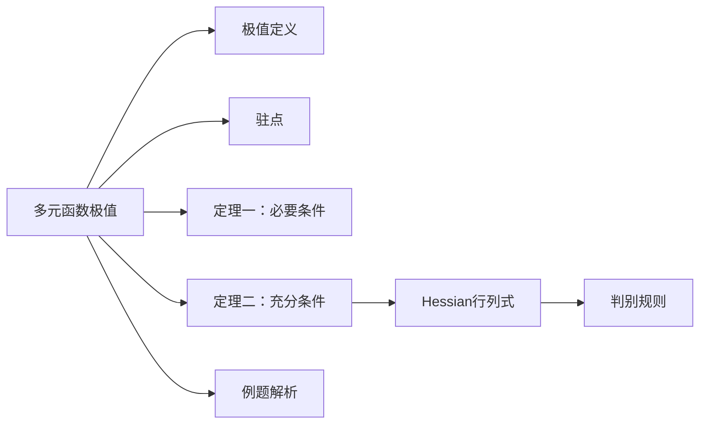

### 高等数学：多元函数的极值法及其求法  
#### **核心知识点梳理**  

| **概念**         | **定义/公式**                                                                 | **说明**                                                                 |
|------------------|-----------------------------------------------------------------------------|--------------------------------------------------------------------------|
| **极值**         | 若 $P_0(x_0,y_0)$ 的邻域内恒有 $f(x,y) \leq f(x_0,y_0)$（或 $\geq$），则 $f(x_0,y_0)$ 为**极大值**（或极小值） | 极值是局部最值，不一定是全局最值。                                               |
| **驻点**         | $\nabla f = \mathbf{0}$，即 $\begin{cases} f_x(x_0,y_0) = 0 \\ f_y(x_0,y_0) = 0 \end{cases}$ | 一阶偏导为零的点，是极值的**候选点**（不一定是极值点，如鞍点）。                     |
| **定理一（必要条件）** | 若 $f(x,y)$ 在 $P_0$ 处可微且取极值，则 $P_0$ 必为驻点。                             | 极值点一定是驻点，但驻点不一定是极值点。                                           |
| **定理二（充分条件）** | 设 $f(x,y)$ 在 $P_0$ 邻域有二阶连续偏导，记 $H = \begin{vmatrix} f_{xx} & f_{xy} \\ f_{yx} & f_{yy} \end{vmatrix}_{P_0}$： 1. 若 $H>0$ 且 $f_{xx}>0$ → **极小值** 2. 若 $H>0$ 且 $f_{xx}<0$ → **极大值** 3. 若 $H<0$ → **非极值点**（鞍点） 4. 若 $H=0$ → 方法失效，需其他方法判定 | $H$ 为 Hessian 行列式，$f_{xy}=f_{yx}$ 由连续性保证。                           |

---

#### **无条件极值例题**  
**题目**：求函数 $f(x,y) = x^3 + y^3 - 3xy$ 的极值。  

**解法**：  
1. **求驻点**：  
   - $f_x = 3x^2 - 3y = 0$ → $x^2 = y$  
   - $f_y = 3y^2 - 3x = 0$ → $y^2 = x$  
   - 联立得解：$(0,0)$ 和 $(1,1)$。  

2. **二阶偏导**：  
   - $f_{xx} = 6x, \quad f_{xy} = -3, \quad f_{yy} = 6y$  

3. **Hessian 判别**：  
   - 在 $(0,0)$：$H = \begin{vmatrix} 0 & -3 \\ -3 & 0 \end{vmatrix} = -9 < 0$ → **鞍点**（非极值）。  
   - 在 $(1,1)$：$H = \begin{vmatrix} 6 & -3 \\ -3 & 6 \end{vmatrix} = 27 > 0$，且 $f_{xx}=6>0$ → **极小值**。  

4. **结果**：  
   - 极小值点：$(1,1)$，极小值 $f(1,1) = 1^3 + 1^3 - 3 \cdot 1 \cdot 1 = -1$。  

---

#### **知识图谱**  

> 此笔记已整合至 [[高等数学核心概念]]，关联内容：[[偏导数]]、[[Hessian矩阵的应用]]。建议结合例题 [[多元函数极值例题]] 练习巩固。