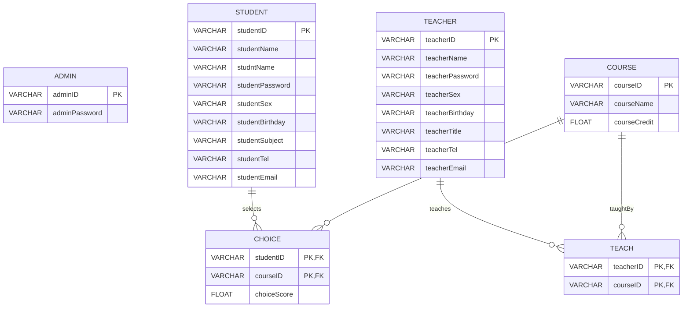

```mermaid

erDiagram

  ADMIN {

    VARCHAR adminID PK

    VARCHAR adminPassword

  }

  

  STUDENT {

    VARCHAR studentID PK

    VARCHAR studentName

    VARCHAR studntName

    VARCHAR studentPassword

    VARCHAR studentSex

    VARCHAR studentBirthday

    VARCHAR studentSubject

    VARCHAR studentTel

    VARCHAR studentEmail

  }

  

  TEACHER {

    VARCHAR teacherID PK

    VARCHAR teacherName

    VARCHAR teacherPassword

    VARCHAR teacherSex

    VARCHAR teacherBirthday

    VARCHAR teacherTitle

    VARCHAR teacherTel

    VARCHAR teacherEmail

  }

  

  COURSE {

    VARCHAR courseID PK

    VARCHAR courseName

    FLOAT   courseCredit

  }

  

  CHOICE {

    VARCHAR studentID PK,FK

    VARCHAR courseID  PK,FK

    FLOAT   choiceScore

  }

  

  TEACH {

    VARCHAR teacherID PK,FK

    VARCHAR courseID  PK,FK

  }

  

  STUDENT ||--o{ CHOICE : selects

  COURSE  ||--o{ CHOICE : chosenBy

  

  TEACHER ||--o{ TEACH  : teaches

  COURSE  ||--o{ TEACH  : taughtBy

```